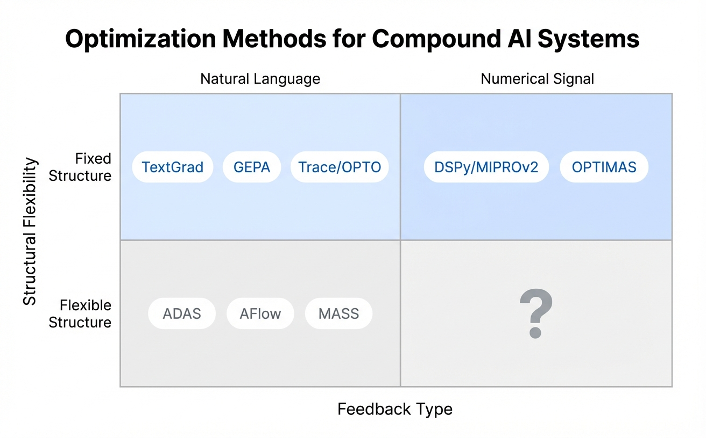
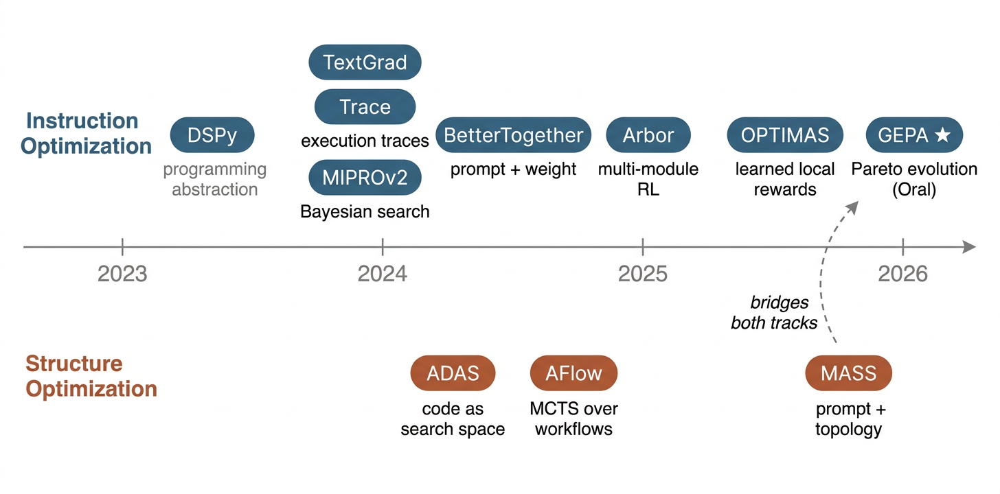
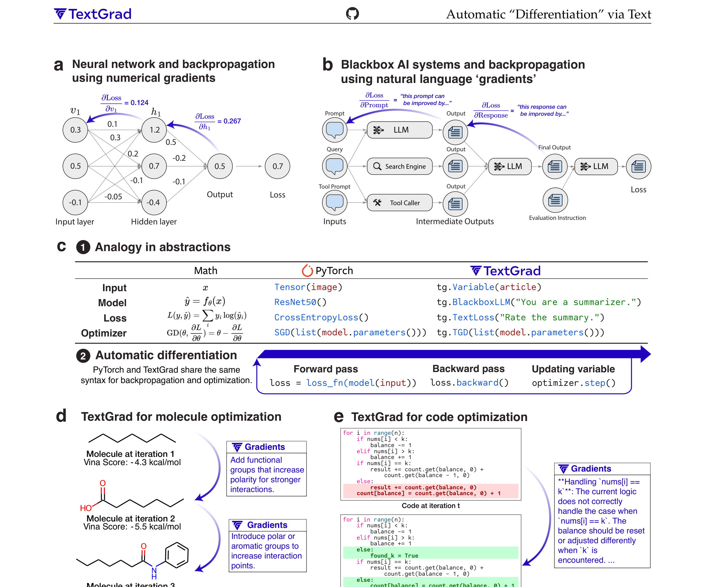
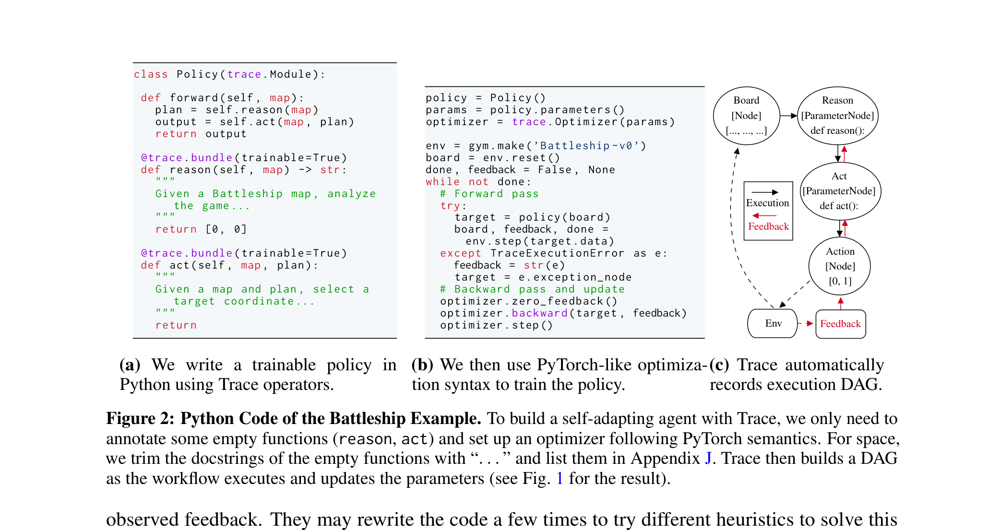
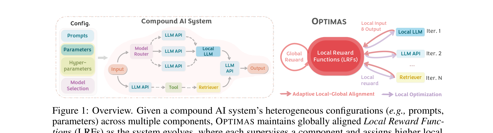
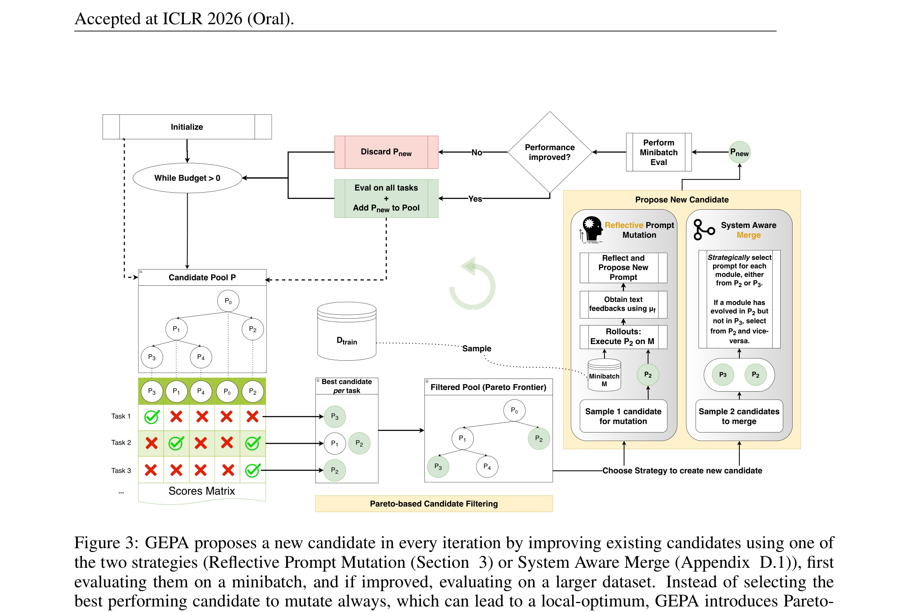
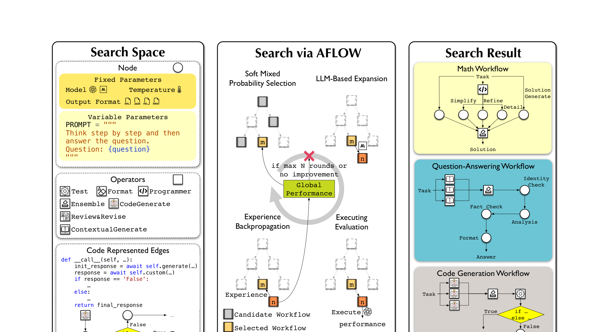
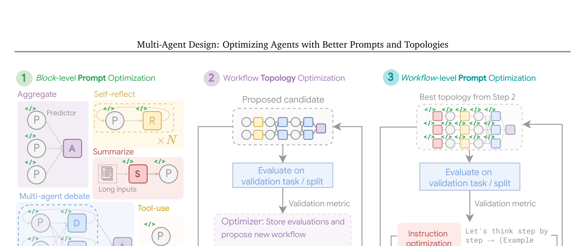

In 2024, FactSet replaced a single GPT-4 call (55% accuracy, 10s latency) with a compound system — Gemini for formula generation, Llama-3 for argument filling, GPT-3.5 for assembly, plus a retrieval layer — and hit [87% accuracy at 3s latency](https://www.databricks.com/blog/factset-genai). A 32-point accuracy jump, not from a better model, but from a better *system*.

This is not an isolated case. Databricks [reports](https://bair.berkeley.edu/blog/2024/02/18/compound-ai-systems/) that 60% of LLM applications in production use retrieval-augmented generation and 30% use multi-step chains. AlphaCode 2 generates up to a million candidate solutions, filters and clusters them, and reaches the [85th percentile of competitive programmers](https://storage.googleapis.com/deepmind-media/AlphaCode2/AlphaCode2_Tech_Report.pdf) — not through a single model call but through an elaborate generate-filter-rank pipeline. Medprompt's chain of nearest-neighbor search, chain-of-thought, and ensembling [outperforms domain-specialized medical models](https://arxiv.org/abs/2311.16452) while using a general-purpose GPT-4.

The pattern has a name: **compound AI systems** — systems that tackle AI tasks using multiple interacting components, including multiple calls to models, retrievers, or external tools ([Zaharia et al. 2024](https://bair.berkeley.edu/blog/2024/02/18/compound-ai-systems/)). This is a broader category than "agentic AI": agents are one design pattern *within* compound systems, alongside RAG pipelines, ensembles, cascades, routing systems, and tool-augmented generation. A [workshop](https://compound-ai-systems-workshop-2024.github.io/) bringing together researchers from OpenAI (Noam Brown), Anthropic, Google DeepMind, LangChain, Stanford, Berkeley, and MIT validated this as a first-class research direction in 2024.

The empirical case is clear: systems engineering often achieves what model scaling cannot. As the BAIR blog put it, tripling an LLM's training budget might improve coding accuracy from 30% to 35%, but engineering a system around the same model can reach 80%. The harder question is: **how do you optimize these systems automatically, rather than by hand-tuning one prompt at a time?**

Since 2023, methods like DSPy, TextGrad, Trace, OPTIMAS, GEPA, ADAS, AFlow, and MASS have attacked this question from remarkably different angles — treating it as program synthesis, as backpropagation through text, as evolutionary search on a Pareto front, or as Monte Carlo tree search over code. This post is the map I wish I had when I started reading these papers. Rather than cataloguing them in isolation, I trace how the ideas connect, formalize the shared optimization problem, and highlight where the key mathematical insights differ.

## A Unified View

Before diving into individual methods, it helps to define the shared problem. Every method in this post, despite superficial differences, solves a variant of the same optimization:

**Notation.** Let $\mathcal{S} = (M_1, \ldots, M_n)$ be a compound AI system with $n$ modules. Each module $M_i$ has parameters $\theta_i$ — these may be prompts (instructions and few-shot demonstrations), model selection choices, numerical hyperparameters, or even trainable weights. We write $\theta = (\theta_1, \ldots, \theta_n)$ for the full configuration. Given training data $\mathcal{D} = \lbrace(x^{(j)}, y^{(j)})\rbrace_{j=1}^N$ and an evaluation metric $\mathcal{L}$, the general objective is:

$$\theta^* = \arg\max_{\theta} \; \mathbb{E}_{(x, y) \sim \mathcal{D}} \left[ \mathcal{L}\bigl(\mathcal{S}(x;\, \theta), \, y\bigr) \right]$$

The challenge, of course, is that $\mathcal{S}$ is a black-box pipeline of LLM calls — non-differentiable, stochastic, and expensive to evaluate. The methods below differ in three fundamental choices:

1. **What to optimize**: instructions only, or also the pipeline structure?
2. **What feedback signal to use**: scalar scores, textual critique, or execution traces?
3. **How to search**: Bayesian optimization, gradient-inspired updates, evolutionary search, or tree search?

A [survey by Lee et al. (2025)](https://arxiv.org/abs/2506.08234) proposed a 2×2 taxonomy along the first two axes. I find it a useful organizing frame:

<figcaption><em>The optimization landscape organized by structural flexibility (rows) and feedback type (columns). Most methods cluster in the top row — fixed structure is the common case in production. The bottom-right quadrant is nearly empty: few methods search over structures using purely numerical signals.</em></figcaption>

Most methods sit in the top row because, in practice, most production pipelines have an engineer-designed DAG that rarely changes. What changes are the prompts, the demonstrations, and the model configurations within each node. Let me start there.

## Instruction Optimization

Instruction optimization treats the pipeline topology as fixed and tunes each module's parameters. The approaches have evolved rapidly:

<figcaption><em>Two parallel tracks of compound AI optimization research. Instruction optimization (top) and structure optimization (bottom) have evolved independently until MASS (2026), which bridges both.</em></figcaption>

### The Programming Abstraction: DSPy

[DSPy](https://arxiv.org/abs/2310.03714) ([Khattab et al. 2023](https://arxiv.org/abs/2310.03714)) introduced the foundational abstraction: treat LLM pipelines as *programs* with learnable parameters. Signatures define I/O contracts, modules define operations, and *teleprompters* (optimizers) automatically tune prompts and demonstrations.

DSPy's compiler bootstraps few-shot demonstrations by running a teacher program, filtering execution traces that pass the metric, and using those passing traces as demos. [MIPROv2](https://arxiv.org/abs/2406.11695) ([Opsahl-Ong et al. 2024](https://arxiv.org/abs/2406.11695)) upgraded this with joint instruction and demonstration optimization via Bayesian surrogate search.

What DSPy got right is the *declarative programming model* — separating *what* a module does (its signature) from *how* it's prompted (its parameters) is what makes optimization possible in the first place. What remains crude is demonstration selection: BootstrapFewShot generates candidates by end-to-end metric filtering without identifying which module caused a failure, measuring diversity, or adapting to optimization progress.

### Textual Gradients: TextGrad

What if we could do backpropagation, but with words instead of numbers?

[TextGrad](https://arxiv.org/abs/2406.07496) ([Yuksekgonul et al., Nature 2025](https://doi.org/10.1038/s41586-025-08661-4)) introduced exactly this. In the forward pass, each module produces an output given its parents in the computation graph. In the backward pass, an LLM critic generates *textual gradients* — natural language critiques that propagate backward, just as numerical gradients flow through a neural network. Using our unified notation:

**Forward pass:** Each module computes its output from its parents:
$$z_i = M_i\bigl(\lbrace z_j : j \in \mathrm{pa}(i)\rbrace;\, \theta_i\bigr)$$

**Backward pass (textual gradient):** A critic LLM generates feedback for each variable by combining the loss evaluation with downstream gradients:
$$g_i = \mathrm{LLM}_{\text{critic}}\bigl(z_i, \, \mathcal{L}, \, \lbrace g_j : j \in \mathrm{ch}(i)\rbrace\bigr)$$

**Update (textual gradient descent):** An editor LLM incorporates the critique to produce an updated parameter:
$$\theta_i \leftarrow \mathrm{LLM}_{\text{edit}}(\theta_i, \, g_i)$$

<figcaption><em>TextGrad mirrors PyTorch's autograd: variables, loss functions, and gradient descent all have textual counterparts. The critique ("the SQL query misses the JOIN on table X") propagates backward through the computation graph. (Image source: <a href="https://arxiv.org/abs/2406.07496">Yuksekgonul et al. 2024</a>)</em></figcaption>

The analogy to PyTorch is deliberate — TextGrad exposes `tg.Variable`, `tg.BlackboxLLM`, `tg.TextLoss`, and `tg.TGD`, making it immediately familiar to ML practitioners. The critique tells you *how* to improve ("the SQL query misses the JOIN"), not just *whether* something is good. This directional guidance is TextGrad's core advantage.

The limitation is equally clear: TextGrad can only optimize text-expressible variables. Model selection, numerical hyperparameters, and trainable weights are outside its reach. And the full backward pass through the computation graph is expensive — each node requires an LLM call.

### Execution Traces as a Universal Signal: Trace/OPTO

[Trace](https://arxiv.org/abs/2406.16218) ([Cheng, Nie & Swaminathan, NeurIPS 2024](https://arxiv.org/abs/2406.16218)) generalized the idea further. Where TextGrad propagates critiques node-by-node, Trace captures the *entire execution trace* — the full computation graph with all intermediate values — and hands it to an optimizer LLM in one shot.

They formalize this as **OPTO** (Optimization with Trace Oracle): the optimizer receives a trace $\tau = (\mathcal{G}, f)$, where $\mathcal{G}$ is the computation graph with intermediate values and $f$ is output feedback, and proposes updated parameters:

$$\theta' = \mathrm{OptoPrime}(\theta, \, \tau)$$

<figcaption><em>Trace converts any workflow into an OPTO instance: the execution trace (a DAG of intermediate computations and values) is formatted as a pseudo-code report and passed to an optimizer LLM. (Image source: <a href="https://arxiv.org/abs/2406.16218">Cheng et al. 2024</a>)</em></figcaption>

Trace uses PyTorch-like syntax (`trace.node`, `trace.bundle`) and handles heterogeneous parameters and non-differentiable operations. The framework is remarkably general — it subsumes prompt optimization, hyperparameter tuning, code debugging, and even robot controller design under the same abstraction.

The trade-off is generality vs. specialization. Trace is competitive with specialized optimizers across diverse tasks but doesn't achieve state-of-the-art on any single one. And the full execution trace can hit context length limits for large computation graphs — a fundamental scaling bottleneck.

### Learning Local Rewards: OPTIMAS

The methods above share a blind spot: they assume all parameters are text. Real compound AI systems also have model selection choices, numerical hyperparameters, retrieval parameters, and sometimes trainable weights.

[OPTIMAS](https://arxiv.org/abs/2507.03041) ([Wu et al., ICLR 2026](https://arxiv.org/abs/2507.03041)) tackles this head-on with a **Local Reward Function (LRF)** for each component. The key insight: if you can learn a reward function that scores each module's output *locally* while correlating with the *global* system metric, you can decouple the optimization — tuning each component independently with whatever method suits its parameter type.

Formally, the LRF for module $i$ is:

$$r_i(x_i, z_i) = h_i \cdot \phi([x_i, z_i])$$

where $\phi$ is a shared LLM backbone and $h_i$ is a component-specific linear projection head. The critical property is **local-global alignment**:

$$r_i(x_i, z_i^+) \geq r_i(x_i, z_i^-) \implies \mathbb{E}\bigl[\mathcal{L}(\mathcal{S}(x;\, \theta) \mid z_i^+)\bigr] \geq \mathbb{E}\bigl[\mathcal{L}(\mathcal{S}(x;\, \theta) \mid z_i^-)\bigr]$$

In words: if the local reward prefers output $z_i^+$ over $z_i^-$, then using $z_i^+$ should also lead to better global performance. The LRF is trained with a Bradley-Terry preference loss:

$$\ell_i = -\mathbb{E}_{(x_i, z_i^+, z_i^-)} \left[\log \sigma\bigl(r_i(x_i, z_i^+) - r_i(x_i, z_i^-)\bigr)\right]$$

<figcaption><em>OPTIMAS learns a Local Reward Function per component, enabling independent optimization of heterogeneous parameters — prompts via OPRO, hyperparameters via grid search, weights via RL. (Image source: <a href="https://arxiv.org/abs/2507.03041">Wu et al. 2026</a>)</em></figcaption>

Once LRFs are trained, each component is optimized independently: OPRO for prompts, grid search for hyperparameters, RL for weights. This decoupling brings both efficiency (no full system runs once LRFs are trained) and a convergence guarantee under mild conditions.

The cost of decoupling is the loss of directional guidance. A scalar reward tells you "this is 0.73" but not "the query misses the JOIN on table X." And coordinate-wise optimization cannot discover optima that require multiple components to change simultaneously.

### Evolutionary Search on a Pareto Front: GEPA

[GEPA](https://arxiv.org/abs/2507.19457) ([Agrawal et al., ICLR 2026 Oral](https://arxiv.org/abs/2507.19457)) takes a different approach entirely: combine trajectory-level reflection with evolutionary search. The algorithm iteratively:

1. **Samples** execution trajectories (both successes and failures)
2. **Reflects** on them in natural language — diagnosing failures and attributing them to specific modules
3. **Proposes** prompt updates based on the diagnosis
4. **Maintains** a Pareto front of the best prompt configurations

The Pareto front is what makes GEPA escape local optima. Rather than keeping a single "best prompt," GEPA maintains a diverse set of non-dominated configurations. Formally, a candidate $\theta_k$ dominates $\theta_l$ if it performs at least as well on every training instance:

$$\theta_k \succ \theta_l \iff \mathcal{L}^{(j)}(\theta_k) \geq \mathcal{L}^{(j)}(\theta_l) \quad \forall\, j \in \lbrace 1, \ldots, |\mathcal{D}_{\text{pareto}}|\rbrace$$

The Pareto front $\mathcal{F}$ consists of all non-dominated candidates:

$$\mathcal{F} = \bigl\lbrace\theta_k : \nexists\, \theta_l \text{ s.t. } \theta_l \succ \theta_k\bigr\rbrace$$

New candidates are sampled proportionally to how frequently they appear in the instance-wise Pareto frontier, biasing search toward configurations that are uniquely good at solving specific types of inputs.

<figcaption><em>GEPA combines natural language reflection on execution trajectories with evolutionary search over a Pareto front of prompt candidates. (Image source: <a href="https://arxiv.org/abs/2507.19457">Agrawal et al. 2026</a>)</em></figcaption>

The results are striking: +13% over MIPROv2, +6% over GRPO with 35× fewer rollouts, all on frozen LLMs without fine-tuning. GEPA is now integrated into DSPy 3.0 as a first-class optimizer. Its strength lies in combining the richness of natural language reflection (like TextGrad) with structured search (the Pareto front), achieving dramatic sample efficiency over RL approaches.

### When Weights Are Available: RL Approaches

When you have access to model weights — open models like Llama or Qwen — you can optimize at both the prompt level and the weight level simultaneously.

[BetterTogether](https://arxiv.org/abs/2407.10930) ([Paria et al., EMNLP 2024](https://arxiv.org/abs/2407.10930)) is a meta-optimizer that alternates prompt optimization and weight fine-tuning in configurable sequences, now integrated into DSPy 3.0. [mmGRPO / Arbor](https://arxiv.org/abs/2508.04660) ([Ziems et al. 2025](https://arxiv.org/abs/2508.04660)) generalizes Group Relative Policy Optimization to multi-module LM programs, grouping LM calls by module across rollouts and handling variable-length trajectories. The combination "BetterTogether(PO, mmGRPO)" alternates prompt optimization and RL fine-tuning.

This direction matters because it bridges prompt-only optimization and weight-level learning. For teams running open models, the question is no longer "prompt engineering or fine-tuning?" but "how to orchestrate both?"

### Comparing the Approaches

To make the relationships concrete, here is how the major instruction optimizers compare:

| | DSPy/MIPROv2 | TextGrad | Trace/OPTO | OPTIMAS | GEPA |
|---|---|---|---|---|---|
| **Feedback** | Metric score | Textual critique | Execution trace | Learned LRF (scalar) | NL reflection on trajectories |
| **Parameters** | Instructions + demos | Text variables | Any parameterized workflow | Prompts, weights, hyperparams | Instructions (prompts) |
| **Search** | Bootstrap + Bayesian | Critique-guided rewrite | Graph-level generative update | Coordinate descent + LRF | Evolutionary + Pareto front |
| **Sample efficiency** | Moderate | Low (full backward pass) | Moderate | Moderate (LRF training) | High (35× fewer than RL) |
| **Heterogeneous configs** | Partial | No (text only) | Yes | Yes (key strength) | No (text only) |
| **Convergence guarantee** | No | No | No | Yes (under assumptions) | No |

A critical gap remains: **TextGrad, GEPA, and OPTIMAS have never been evaluated on the same benchmarks.** Each paper uses different tasks and models. The field needs a unified evaluation suite — perhaps the most impactful contribution someone could make right now.

### The Hybrid Opportunity

These approaches have complementary strengths, and natural combinations remain unexplored:

- **OPTIMAS's LRF + TextGrad's critique**: The LRF answers "which candidate is better" (fast scoring), while the critique answers "how to generate better candidates" (directional guidance). This could address OPTIMAS's blind 3-candidate search.
- **GEPA's trajectory reflection + OPTIMAS's heterogeneous support**: GEPA currently only optimizes text prompts. Extending its reflection to score non-text configurations would broaden its reach.
- **Trace's execution graph + GEPA's Pareto search**: Trace provides a principled way to extract signals from execution traces; GEPA provides a principled way to search over candidates. Combining them could yield both coverage and efficiency.

## Structure Optimization

Structure optimization goes beyond tuning parameters within a fixed topology — it searches over the topology itself: which modules to include, how to wire them, how many copies to run.

### Code as Search Space: ADAS

[ADAS](https://arxiv.org/abs/2408.08435) ([Hu et al., ICLR 2025](https://arxiv.org/abs/2408.08435)) proposed a striking idea: define the search space as *arbitrary Python code*. A meta-agent (LLM) iteratively writes new agent implementations, evaluates them, and adds them to an ever-growing archive. The code-based search space is Turing-complete — it can theoretically discover any possible agentic system.

ADAS's historical significance is as the first method to propose code-as-search-space for agentic systems. It directly inspired both AFlow and MASS. Its limitation is the flat archive: a linear list of (agent, score) pairs with no structure, leading to context bloat as the archive grows.

### MCTS over Workflows: AFlow

[AFlow](https://arxiv.org/abs/2410.10762) ([Zhang et al., ICLR 2025](https://arxiv.org/abs/2410.10762)) replaced ADAS's flat archive with **Monte Carlo Tree Search**. Tree nodes represent complete workflows; expansion means asking an LLM to modify code. The tree structure tracks which modifications helped on which branch — structured experience management.

AFlow introduced reusable **operators** (Ensemble, Review & Revise, etc.) as building blocks and uses a soft mixed probability for node selection that balances exploration and exploitation:

$$P_{\text{select}}(i) = \lambda \cdot \frac{1}{n} + (1 - \lambda) \cdot \frac{\exp\bigl(\alpha \cdot (s_i - s_{\max})\bigr)}{\sum_j \exp\bigl(\alpha \cdot (s_j - s_{\max})\bigr)}$$

where $s_i$ is workflow $i$'s score, $\alpha = 0.4$ controls score sensitivity, and $\lambda = 0.2$ balances uniform exploration against exploitation.

<figcaption><em>AFlow applies Monte Carlo Tree Search to workflow discovery. Each node is a complete workflow; expansion creates modified variants. The tree structure provides principled exploration-exploitation trade-off. (Image source: <a href="https://arxiv.org/abs/2410.10762">Zhang et al. 2024</a>)</em></figcaption>

The results are compelling: 80.3% average across 6 benchmarks (+19.5% over ADAS), and workflows discovered with GPT-4o-mini transfer to other models — small models with AFlow-discovered workflows match GPT-4o performance at 4.55% of the inference cost. The limitation: AFlow searches structure but uses default prompts, leaving significant performance on the table.

### Prompts Matter More Than Topology: MASS

[MASS](https://arxiv.org/abs/2502.02533) ([Zhou et al., ICLR 2026](https://arxiv.org/abs/2502.02533)) delivers what may be the most important empirical finding in this space:

> **A single prompt-optimized CoT agent outperforms multi-agent topologies with default prompts at comparable token budgets.**

On MATH with Gemini 1.5 Pro, optimizing the prompt of a single agent and then scaling with self-consistency dominates all multi-agent configurations — self-refine, debate, ensemble — that use default prompts. *Prompt quality trumps agent quantity.*

MASS operationalizes this insight with a 3-stage pipeline:

1. **Stage 1 (Local Prompt Warmup):** Optimize prompts for each topology block independently
2. **Stage 2 (Topology Search):** Search over a pruned topology space using **influence scores**: $I_i = \mathcal{L}^*(\mathcal{S}_i) / \mathcal{L}^*(\mathcal{S}_0)$, measuring the relative gain from each topology dimension. Block selection follows $p_i = \mathrm{Softmax}(I_i, \, t)$.
3. **Stage 3 (Global Prompt Re-optimization):** Re-optimize all prompts jointly for the best topology — because locally-optimized prompts are not globally optimal when composed

<figcaption><em>MASS's 3-stage framework: first optimize prompts locally per block (Stage 1), then search over topologies using influence-weighted pruning (Stage 2), then re-optimize prompts globally for the best topology (Stage 3). (Image source: <a href="https://arxiv.org/abs/2502.02533">Zhou et al. 2026</a>)</em></figcaption>

Important caveats: the "topology search" is constrained to a fixed block ordering `[summarize, reflect, debate, aggregate]` where the search decides which blocks to include and their scale. This is block selection, not arbitrary graph search like AFlow. And MASS uses MIPROv2 as its plug-in prompt optimizer — gains may largely stem from MIPROv2 itself.

### When Does Structure Actually Matter?

MASS and the concurrent ["Rethinking Multi-Agent Workflows"](https://arxiv.org/abs/2601.12307) ([ICLR 2026](https://arxiv.org/abs/2601.12307)) converge on a nuanced answer:

**Structure matters less than expected** for homogeneous systems (same LLM in every role). A single well-prompted agent with self-consistency often suffices. Multi-turn conversation within one agent can approximate multi-agent debate, with better KV cache efficiency.

**Structure matters more than expected** when modules are **heterogeneous** (different LLMs, tools, retrievers, or code executors play genuinely different roles), when the task requires **tool integration** (retrieval, code execution, API calls), or when specific topologies are **task-dependent** (debate helps on HotpotQA but hurts on LiveCodeBench).

The practical takeaway: **optimize prompts first, then consider adding structure.**

## The Credit Assignment Problem

Underlying both instruction and structure optimization is a shared challenge: **credit assignment**. When a compound AI system produces a wrong answer, which module caused the failure? The quality of optimization depends directly on the quality of this attribution.

The methods reviewed above handle credit assignment very differently:

| Method | Approach | Granularity |
|---|---|---|
| DSPy/MIPROv2 | End-to-end metric filtering | Binary (pass/fail) |
| TextGrad | Backward propagation of critique through graph | Per-variable (textual) |
| OPTIMAS | Learned LRF per component with local-global alignment | Per-component (scalar) |
| GEPA | NL reflection on full execution trajectories | Per-module (implicit) |
| Trace/OPTO | Full execution trace passed to optimizer | Structured (trace + feedback) |

The trend is clear: methods are moving from coarse signals (end-to-end pass/fail) toward fine-grained, per-module attribution. This mirrors the lesson from process reward models ([Lightman et al. 2023](https://arxiv.org/abs/2305.20050)): **process supervision dramatically outperforms outcome supervision** — 78.2% vs. 72.4% on MATH. The same principle should hold for compound AI: per-module feedback should outperform end-to-end feedback.

## Looking Ahead

Despite rapid progress, several fundamental questions remain open:

**Unified evaluation.** GEPA, OPTIMAS, and TextGrad are each evaluated on different tasks with different models. The most impactful near-term contribution may not be a new method but a standardized benchmark enabling apples-to-apples comparison.

**Scaling to production.** Every method discussed here has been validated on systems with $\leq 5$ components. Real production pipelines can have 10–20+ modules. Whether coordinate descent (OPTIMAS), backward propagation (TextGrad), or evolutionary search (GEPA) scale to this regime is an open empirical question.

**True co-optimization.** MASS's 3-stage pipeline is the only attempt at joint instruction + structure optimization, and its topology search is constrained. A principled co-optimizer that combines AFlow's structural expressiveness with GEPA's instruction optimization does not yet exist.

**Data selection.** Instruction optimization has matured rapidly (OPRO → MIPROv2 → GEPA). But *which examples each module learns from* — demonstration selection — is still handled by DSPy's 2023-era bootstrap and random search. Principled, system-aware example selection remains wide open.

**Deployment cost.** Optimization requires hundreds of system runs. [Databricks Agent Bricks](https://www.databricks.com/blog/introducing-agent-bricks) is the first production deployment of these ideas, reporting 2× accuracy improvements. But for most teams, compound AI optimization remains a research tool, not a production practice.

## References

[1] Omar Khattab, Arnav Singhvi, Paridhi Maheshwari, et al. ["DSPy: Compiling Declarative Language Model Calls into Self-Improving Pipelines."](https://arxiv.org/abs/2310.03714) arXiv preprint, 2023.

[2] Chengrun Yang, Xuezhi Wang, Yifeng Lu, et al. ["Large Language Models as Optimizers."](https://arxiv.org/abs/2309.03409) ICLR, 2024.

[3] Hunter Lightman, Vineet Kosaraju, Yura Burda, et al. ["Let's Verify Step by Step."](https://arxiv.org/abs/2305.20050) ICLR, 2024.

[4] Ching-An Cheng, Allen Nie, and Adith Swaminathan. ["Trace is the Next AutoDiff: Generative Optimization with Rich Feedback, Execution Traces, and LLMs."](https://arxiv.org/abs/2406.16218) NeurIPS, 2024.

[5] Mert Yuksekgonul, Federico Bianchi, Joseph Boen, et al. ["TextGrad: Automatic 'Differentiation' via Text."](https://arxiv.org/abs/2406.07496) Nature, 2025.

[6] Krista Opsahl-Ong, Michael J Ryan, Josh Purtell, et al. ["Optimizing Instructions and Demonstrations for Multi-Stage Language Model Programs."](https://arxiv.org/abs/2406.11695) arXiv preprint, 2024.

[7] Shengran Hu, Cong Lu, and Jeff Clune. ["Automated Design of Agentic Systems."](https://arxiv.org/abs/2408.08435) ICLR, 2025.

[8] Jiayi Zhang, Jinyu Xiang, Zhaoyang Yu, et al. ["AFlow: Automating Agentic Workflow Generation."](https://arxiv.org/abs/2410.10762) ICLR, 2025.

[9] Biswajit Paria, Barnabas Poczos, Pradeep Dasigi, et al. ["BetterTogether: Alternating between Prompt Optimization and Fine-Tuning for LM Programs."](https://arxiv.org/abs/2407.10930) EMNLP, 2024.

[10] Shirley Wu, Parth Sarthi, Shiyu Zhao, et al. ["OPTIMAS: Optimizing Compound AI Systems with Globally Aligned Local Rewards."](https://arxiv.org/abs/2507.03041) ICLR, 2026.

[11] Lakshya A Agrawal, Shang-lin Tan, Dilara Soylu, et al. ["GEPA: Reflective Prompt Evolution Can Outperform Reinforcement Learning."](https://arxiv.org/abs/2507.19457) ICLR, 2026 (Oral).

[12] Xiangru Zhou, Tianyu Liu, Haolin Chen, et al. ["Multi-Agent Design: Optimizing Agents with Better Prompts and Topologies."](https://arxiv.org/abs/2502.02533) ICLR, 2026.

[13] Caleb Ziems, William Held, Omar Khattab, and Diyi Yang. ["Arbor: Training LM Agents with Multi-Module RL."](https://arxiv.org/abs/2508.04660) arXiv preprint, 2025.

[14] Hyunwoo Lee, Haoran Zhao, and Jack Parker-Holder. ["A Survey on Automatic Optimization of Compound AI Systems."](https://arxiv.org/abs/2506.08234) EMNLP, 2025.
